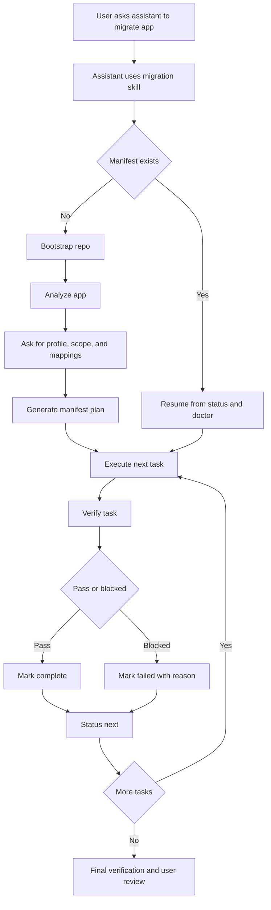

# LLM-Led Migration Reference

> **Experimental** — The OpenZeppelin UI Kit migration tools described here are **highly experimental** and **under constant improvement**. You should **not** expect 100% accuracy on every codebase. At the same time, we rely on a **set of deterministic `oz-ui migrate` CLI commands**, structured manifests, and verifiable steps—and we have been **testing on small- to medium-sized applications**. The experience will get better over time. **Using this workflow is still a practical improvement over attempting the same migration entirely on your own** without that structure.

This document explains the intended migration experience when the **user talks to an LLM** and the **LLM uses the CLI underneath**.

## In One Sentence

The user should ask the assistant to migrate the app in plain English; the assistant should use the migration skill, optional subagents, and the CLI-backed manifest workflow to do the work safely.

## The Model

- The **user** talks to the assistant
- The **assistant** drives the migration
- The **CLI** provides structure, state, and verification
- The **manifest** makes the process resumable
- The **subagents** are optional specialist roles used by the assistant when supported by the host

## Simple Flow




## What Must Exist First

The target repo should end up with:

- `@openzeppelin/ui-cli`
- the migration skill:
  - `.cursor/skills/migrate-to-oz-uikit/SKILL.md`
  - `.claude/skills/migrate-to-oz-uikit/SKILL.md`
- the migration agent prompts:
  - `.cursor/agents/migration-analyzer.md`
  - `.cursor/agents/migration-executor.md`
  - `.cursor/agents/migration-verifier.md`
  - and the same under `.claude/agents/`

The current setup flow installs or copies those assets through `oz-ui migrate init`.

> **Important**: `oz-ui` is a locally-installed binary (dev dependency), not a global command.
> Always run it through the project's package manager:
> `npx oz-ui ...`, `pnpm exec oz-ui ...`, or `pnpm oz-ui ...` (if the project has an `oz-ui` script).
> Never run bare `oz-ui` — it will fail with "command not found".

## What The User Should Say

Bootstrap and migrate (fresh project):

```text
Install @openzeppelin/ui-cli as a dev dependency, then run `npx oz-ui migrate init --project .` to set up the migration skill and OZ packages. Once init finishes, read the skill at .cursor/skills/migrate-to-oz-uikit/SKILL.md and follow it to migrate this app to OpenZeppelin UI Kit. Ask me only when you need profile/scope decisions or manual validation.
```

With preferences:

```text
Install @openzeppelin/ui-cli as a dev dependency, then run `npx oz-ui migrate init --project .` to set up the migration skill and OZ packages. Once init finishes, read the skill at .cursor/skills/migrate-to-oz-uikit/SKILL.md and follow it to migrate this app to OpenZeppelin UI Kit. Prefer the transactor profile. Migrate the whole app unless you find risky areas.
```

Resume later (skill and manifest already exist):

```text
Read the skill at .cursor/skills/migrate-to-oz-uikit/SKILL.md and resume the OpenZeppelin UI migration from the existing migration-manifest.json.
```

## What The Assistant Does

### 1. Bootstrap the repo

The assistant prepares the repo for migration:

1. installs `@openzeppelin/ui-cli` as a dev dependency
2. runs `npx oz-ui migrate init --project .` (or `pnpm exec oz-ui migrate init --project .`)
3. reads the skill file that init copied (`.cursor/skills/migrate-to-oz-uikit/SKILL.md`)
4. follows that skill for all subsequent steps

The `init` command installs OZ packages, wires provider templates, normalizes Tailwind, and copies the skill and agent prompts into the repo.

### 2. Decide whether this is fresh or resumed

The assistant checks for `migration-manifest.json`.

- No manifest: start fresh
- Existing manifest: resume from it

### 3. Analyze the app

The assistant gathers:

- framework
- source UI library
- component matches
- wallet usage
- storage usage
- adapter usage
- Tailwind health
- effort estimate

Then it explains the findings in plain English and asks only the decisions that matter.

### 4. Generate the plan

The assistant creates `migration-manifest.json`.

That manifest becomes the source of truth for:

- phases
- tasks
- dependencies
- progress
- blockers

### 5. Execute tasks one by one

The assistant follows the manifest and uses the CLI loop underneath:

- execute deterministic tasks
- perform manual edits when required
- verify the result
- mark the task completed or failed

### 6. Verify continuously

The assistant does not wait until the very end. It validates during the migration and uses explicit lifecycle updates so manifest state stays aligned with code state.

### 7. Finish and hand back to the user

At the end, the assistant should:

- run final verification
- summarize remaining risks
- recommend visual and functional testing

## Deterministic vs Manual Tasks

### Usually deterministic

- package installation
- provider wiring
- Tailwind normalization
- many direct component replacements
- many direct form-field replacements

### Usually manual-review

- wallet migration
- storage migration
- schema-form migration

For manual tasks, the assistant still does the work, but it must verify and explicitly update task state instead of pretending the task was fully automatic.

## How `status --next` Fits In

`status --next` is the main guidance mechanism for the assistant.

It tells the assistant:

- the next actionable task
- the recommended next command sequence

Typical examples:

- pending task -> execute it
- in-progress manual task -> validate it, then complete or fail it

## Where Subagents Fit

Subagents are an **internal implementation detail**, not a user-facing step.

The user should not need to say:

- "run the analyzer subagent"
- "run the verifier subagent"

Instead, the main assistant may delegate internally when the host supports it.

### The three migration subagents

- `migration-analyzer`
- `migration-executor`
- `migration-verifier`

## The Actual Under-The-Hood Loop

The assistant is effectively doing this:

1. bootstrap if needed
2. analyze the app
3. generate the manifest
4. ask `status --next`
5. execute the next task
6. if manual, edit code and verify it
7. mark complete or fail
8. repeat until done

The user should mostly see natural-language progress updates, not raw CLI operations.

## The Most Practical Prompt

If you want a single good user prompt, use this:

```text
Install @openzeppelin/ui-cli as a dev dependency, then run `npx oz-ui migrate init --project .` to bootstrap the migration. Once init finishes, read the skill at .cursor/skills/migrate-to-oz-uikit/SKILL.md and follow it to migrate this app to OpenZeppelin UI Kit. Ask me only when you need profile/scope decisions or manual validation.
```

The key insights:

1. The LLM does not know about the CLI or the skill until `init` copies everything into the repo. The prompt must be explicit about the install command, the init command, and the path to the skill file.
2. `oz-ui` is a locally-installed binary, not a global command. The prompt must use `npx oz-ui` (or `pnpm exec oz-ui`) — bare `oz-ui` will fail.

## Final Takeaway

The intended experience is:

1. The user asks for migration in plain English.
2. The assistant sets up the repo if needed.
3. The assistant analyzes, plans, executes, verifies, and resumes from the manifest.
4. The CLI provides reliability under the hood.
5. Subagents may help internally, but the user should not need to think about them.

