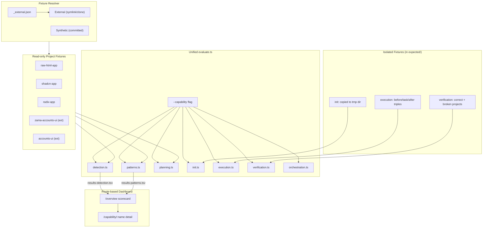

# Autoresearch: 7-Capability Improvement Loop

An autonomous experiment loop — inspired by [Karpathy's autoresearch](https://github.com/karpathy/autoresearch) — that iteratively improves all 7 capabilities of the `@openzeppelin/ui-cli` migration system.

## Capabilities


| #   | Capability        | Metric                                              |
| --- | ----------------- | --------------------------------------------------- |
| 1   | **Detection**     | F1 on (name, ozTarget) tuples                       |
| 2   | **Patterns**      | F1 on (pattern, file) tuples                        |
| 3   | **Planning**      | Gated composite (Task F1 + Wallet F1 + Phase order) |
| 4   | **Init**          | Weighted checklist score                            |
| 5   | **Execution**     | AST parse + structural similarity                   |
| 6   | **Verification**  | Classification accuracy + diagnostic precision      |
| 7   | **Orchestration** | Structural checklist (+ future subagent replay)     |


Run `pnpm --filter @openzeppelin/ui-cli evaluate:all` to see live scores.

## Architecture




## Quick start

### 1. Resolve external fixtures

```bash
pnpm --filter @openzeppelin/ui-cli fetch-fixtures
```

This symlinks real-world projects from local sibling repos (or sparse-clones from remote if unavailable). Run `fetch-fixtures:status` to check resolution.

### 2. Run all evaluations

```bash
pnpm --filter @openzeppelin/ui-cli evaluate:all
```

### 3. Run a single capability

```bash
npx tsx autoresearch/evaluate.ts --capability detection
npx tsx autoresearch/evaluate.ts --capability patterns
npx tsx autoresearch/evaluate.ts --capability planning
npx tsx autoresearch/evaluate.ts --capability init
npx tsx autoresearch/evaluate.ts --capability execution
npx tsx autoresearch/evaluate.ts --capability verification
npx tsx autoresearch/evaluate.ts --capability orchestration
```

### 4. Start the dashboard

```bash
pnpm --filter @openzeppelin/ui-cli dashboard
```

Open [http://localhost:4200](http://localhost:4200). The overview page shows all 7 capabilities as scorecards. Click into any capability for the detailed experiment chart, fixture breakdown, and log.

### 5. Start an agent

Open a new Cursor agent chat and specify which capability to work on:

> You are an autonomous research agent. Read and follow the protocol in `packages/cli/autoresearch/program-detection.md` exactly. Your working directory is `packages/cli`. Begin the experiment loop now.

Each capability has its own program file:


| Capability    | Agent protocol             |
| ------------- | -------------------------- |
| Detection     | `program-detection.md`     |
| Patterns      | `program-patterns.md`      |
| Planning      | `program-planning.md`      |
| Init          | `program-init.md`          |
| Execution     | `program-execution.md`     |
| Verification  | `program-verification.md`  |
| Orchestration | `program-orchestration.md` |


## Fixture management

Fixtures come from two sources:

- **Synthetic** (committed) — small, purpose-built test apps in `fixtures/` (e.g., `radix-app`, `shadcn-app`, `raw-html-app`)
- **External** (resolved at runtime) — real-world projects defined in `fixtures/_external.json`, resolved via local sibling repos or sparse git clone

### Resolve external fixtures

```bash
npx tsx autoresearch/fetch-fixtures.ts           # resolve all missing
npx tsx autoresearch/fetch-fixtures.ts --status   # show resolution status
npx tsx autoresearch/fetch-fixtures.ts --clean    # remove fetched/linked externals
```

Resolution priority: **already in `fixtures/`** → **local sibling path** (symlink) → **sparse clone from remote** (pinned commit).

### Adding a new external fixture

1. Add an entry to `fixtures/_external.json`:

```json
{
  "name": "my-app",
  "repo": "https://github.com/org/my-app",
  "commit": "<pinned-sha>",
  "localPaths": ["~/dev/repos/org/my-app"],
  "sparsePaths": ["src/", "package.json"],
  "description": "Brief description"
}
```

1. Add the name to `fixtures/.gitignore` so the resolved copy is not committed.
2. Run `npx tsx autoresearch/fetch-fixtures.ts` to resolve it.
3. Create ground truth in `expected/my-app.json` (detection) and `expected/patterns/my-app.json` (patterns).
4. Run evaluation:

```bash
pnpm --filter @openzeppelin/ui-cli evaluate:all
```

### Adding a synthetic fixture

For small, targeted test scenarios, add directly to `fixtures/`:

```bash
mkdir -p autoresearch/fixtures/my-test-app/src
# add source files...
```

These are committed to git and always available.

## Directory structure

```
autoresearch/
  evaluate.ts                    # Unified harness with --capability flag
  fetch-fixtures.ts              # Resolves external fixtures (symlink or clone)
  capabilities/
    shared.ts                    # F1 computation, checklist scoring, utilities
    fixture-resolver.ts          # Multi-source fixture resolution
    detection.ts                 # Capability 1: component detection
    patterns.ts                  # Capability 2: pattern scanning
    planning.ts                  # Capability 3: plan generation
    init.ts                      # Capability 4: init / setup
    execution.ts                 # Capability 5: code rewriting
    verification.ts              # Capability 6: doctor / verification
    orchestration.ts             # Capability 7: SKILL.md orchestration
  program-detection.md           # Agent protocol per capability
  program-patterns.md
  program-planning.md
  program-init.md
  program-execution.md
  program-verification.md
  program-orchestration.md
  results-detection.tsv          # Experiment logs per capability
  results-patterns.tsv
  ...
  dashboard.ts                   # Route-based HTTP server
  dashboard.html                 # Overview + detail pages
  fixtures/
    _external.json               # External fixture manifest (committed)
    .gitignore                   # Ignores resolved external fixture dirs
    radix-app/                   # Synthetic (committed)
    raw-html-app/                # Synthetic (committed)
    shadcn-app/                  # Synthetic (committed)
    zama-accounts-ui/            # External (symlink, gitignored)
    accounts-ui/                 # External (symlink, gitignored)
  expected/
    *.json                       # Detection ground truth
    patterns/                    # Pattern scanning ground truth
    planning/                    # Planning ground truth + frozen reports
      frozen-reports/
    init/                        # Init checklist expectations
    execution/                   # Code rewriting triples (before/task/after)
      tier1/
      tier2/
      tier3/
    verification/                # Doctor verification fixtures
      correct/
      broken/
    orchestration/               # Orchestration scenario fixtures
```

## Editable surface per capability


| Capability    | Editable files                                                      |
| ------------- | ------------------------------------------------------------------- |
| Detection     | `component-matcher.ts`, `source-libraries/*.json`                   |
| Patterns      | `pattern-scanner.ts`, optional JSON pattern files                   |
| Planning      | `planning/generate.ts`, `catalog/exclusions.json`                   |
| Init          | `init/setup.ts`, `templates/**`                                     |
| Execution     | `rewriter/rewriteFile.ts`, `source-libraries/*.json` (propMappings) |
| Verification  | `verification/checker.ts`                                           |
| Orchestration | `templates/skills/migrate-to-oz-uikit/SKILL.md`                     |


## Dashboard

The route-based dashboard at [http://localhost:4200](http://localhost:4200):

- `**/**` — Overview scorecard showing all 7 capabilities with scores and experiment counts
- `**/capability/:name**` — Detail page with scatter chart, per-fixture breakdown, and experiment log
- `**/api/capabilities**` — Summary JSON for all capabilities
- `**/api/results/:name**` — Results TSV data as JSON
- `**/api/evaluate/:name**` — Live evaluation trigger
- `**/api/stream**` — SSE for real-time updates

## Results format

Each capability has a separate `results-<capability>.tsv`:

```
<experiment_number>\t<status>\t<score>\t<description>
```

Status: `keep` (improved), `discard` (no improvement, reverted), `crash` (tests failed, reverted)