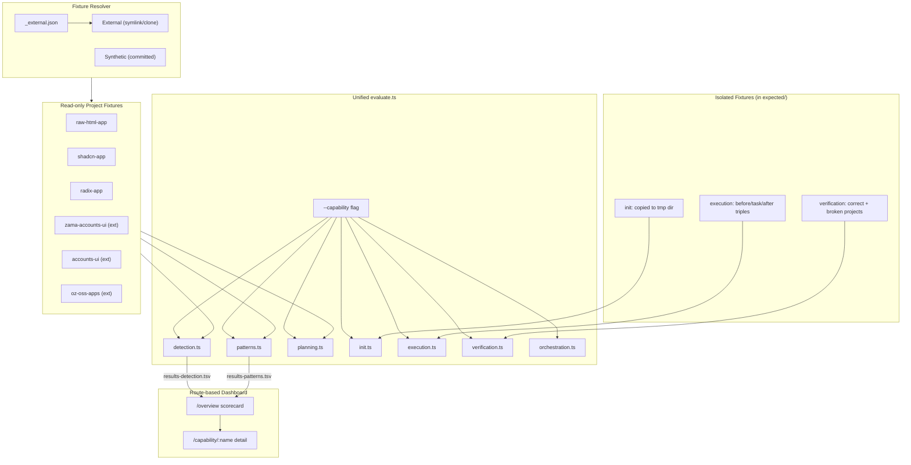

# Autoresearch: 7-Capability Improvement Loop

An autonomous experiment loop — inspired by [Karpathy's autoresearch](https://github.com/karpathy/autoresearch) — that iteratively improves all 7 capabilities of the `@openzeppelin/ui-cli` migration system.

## Capabilities


| #   | Capability        | Metric                                              |
| --- | ----------------- | --------------------------------------------------- |
| 1   | **Detection**     | F1 on (name, ozTarget) tuples                       |
| 2   | **Patterns**      | F1 on (pattern, file) tuples                        |
| 3   | **Planning**      | Gated composite (Task F1 + Wallet F1 + Phase order) |
| 4   | **Init**          | Weighted checklist score                            |
| 5   | **Execution**     | AST parse + structural similarity                   |
| 6   | **Verification**  | Classification accuracy + diagnostic precision      |
| 7   | **Orchestration** | Structural checklist (+ future subagent replay)     |


Run `pnpm --filter @openzeppelin/ui-cli evaluate:all` to see live scores.

## Architecture




## Quick start

### 1. Resolve external fixtures

```bash
pnpm --filter @openzeppelin/ui-cli fetch-fixtures
```

This symlinks real-world projects from local sibling repos (or sparse-clones from remote if unavailable). Run `fetch-fixtures:status` to check resolution.

### 2. Run all evaluations

```bash
pnpm --filter @openzeppelin/ui-cli evaluate:all
```

### 3. Run a single capability

```bash
npx tsx autoresearch/evaluate.ts --capability detection
npx tsx autoresearch/evaluate.ts --capability patterns
npx tsx autoresearch/evaluate.ts --capability planning
npx tsx autoresearch/evaluate.ts --capability init
npx tsx autoresearch/evaluate.ts --capability execution
npx tsx autoresearch/evaluate.ts --capability verification
npx tsx autoresearch/evaluate.ts --capability orchestration
```

### 4. Start the dashboard

```bash
pnpm --filter @openzeppelin/ui-cli dashboard
```

Open [http://localhost:4200](http://localhost:4200). The overview page shows all 7 capabilities as scorecards. Click into any capability for the detailed experiment chart, fixture breakdown, and log.

### 5. Start an agent

Open a new Cursor agent chat and specify which capability to work on:

> You are an autonomous research agent. Read and follow the protocol in `packages/cli/autoresearch/program-detection.md` exactly. Your working directory is `packages/cli`. Begin the experiment loop now.

Each capability has its own program file:


| Capability    | Agent protocol             |
| ------------- | -------------------------- |
| Detection     | `program-detection.md`     |
| Patterns      | `program-patterns.md`      |
| Planning      | `program-planning.md`      |
| Init          | `program-init.md`          |
| Execution     | `program-execution.md`     |
| Verification  | `program-verification.md`  |
| Orchestration | `program-orchestration.md` |


## Fixture management

**Adding or updating a fixture?** Read **[fixtures-and-expectations.md](./fixtures-and-expectations.md)** first. It explains what expectation files are for, how they differ from “shaping” scores, the full checklist (source + `expected/` + config), and includes an **example LLM prompt** for drafting pattern ground truth.

Fixtures come from two sources:

- **Synthetic** (committed) — small, purpose-built test apps in `fixtures/` (e.g., `radix-app`, `shadcn-app`, `raw-html-app`)
- **External** (resolved at runtime) — real-world projects defined in `fixtures/_external.json`, resolved via local sibling repos or sparse git clone

### Resolve external fixtures

```bash
npx tsx autoresearch/fetch-fixtures.ts           # resolve all missing
npx tsx autoresearch/fetch-fixtures.ts --status   # show resolution status
npx tsx autoresearch/fetch-fixtures.ts --clean    # remove fetched/linked externals
```

Resolution priority: **already in `fixtures/`** → `**FIXTURE_<NAME>_PATH` env var** → **sibling repo** (parent or grandparent of monorepo root: `../<siblingRepo>/<subPath?>`) → **sparse clone from remote** (pinned commit).

### Adding a new external fixture

1. Add an entry to `fixtures/_external.json` (see [fixtures-and-expectations.md](./fixtures-and-expectations.md) for fields and pitfalls).
2. Add the fixture directory to `fixtures/.gitignore` when the resolved tree must not be committed.
3. Run `npx tsx autoresearch/fetch-fixtures.ts` to resolve it.
4. Register splits/tags in `config/detection-fixtures.json` and/or `config/pattern-fixtures.json` if this fixture should score on those capabilities.
5. **Author ground truth** under `expected/` (detection, patterns, planning, etc.—not only the fixture source). See the full checklist and LLM prompt template in **[fixtures-and-expectations.md](./fixtures-and-expectations.md)**.
6. Run `pnpm --filter @openzeppelin/ui-cli evaluate:all` (or single-capability `evaluate.ts`).

### Adding a synthetic fixture

For small, targeted test scenarios, add under `autoresearch/fixtures/<name>/` and commit. You still need the same `**expected/`** and **config** updates as for external fixtures if the benchmark should include this app—see **[fixtures-and-expectations.md](./fixtures-and-expectations.md)**.

## Directory structure

```
autoresearch/
  README.md
  fixtures-and-expectations.md   # How to add fixtures + author expected/* ground truth (incl. LLM prompt)
  evaluate.ts                    # Unified harness with --capability flag
  fetch-fixtures.ts              # Resolves external fixtures (symlink or clone)
  lint-shared.ts                 # Shared lint infrastructure (fixture ID extraction, string-literal checks)
  lint-detection.ts              # Structural lint gate for detection
  lint-patterns.ts               # Structural lint gate for patterns
  lint-planning.ts               # Structural lint gate for planning
  lint-verification.ts           # Structural lint gate for verification
  lint-execution.ts              # Structural lint gate for execution
  generate-adversarial-fixture.ts   # Adversarial fixture for detection generalization testing
  generate-adversarial-execution.ts # Adversarial fixtures for execution generalization testing
  generate-adversarial-verification.ts # Adversarial fixtures for verification generalization testing
  capabilities/
    shared.ts                    # F1 computation, checklist scoring, utilities
    fixture-resolver.ts          # Multi-source fixture resolution
    detection.ts                 # Capability 1: component detection
    patterns.ts                  # Capability 2: pattern scanning
    planning.ts                  # Capability 3: plan generation
    init.ts                      # Capability 4: init / setup
    execution.ts                 # Capability 5: code rewriting
    verification.ts              # Capability 6: doctor / verification
    orchestration.ts             # Capability 7: SKILL.md orchestration
  program-detection.md           # Agent protocol per capability
  program-patterns.md
  program-planning.md
  program-init.md
  program-execution.md
  program-verification.md
  program-orchestration.md
  results-detection.tsv          # Experiment logs per capability
  results-patterns.tsv
  ...
  dashboard.ts                   # Route-based HTTP server
  dashboard.html                 # Overview + detail pages
  config/
    detection-fixtures.json      # Detection splits/tags (incl. adversarial)
    pattern-fixtures.json        # Pattern splits/tags
  fixtures/
    _external.json               # External fixture manifest (committed)
    .gitignore                   # Ignores resolved external fixture dirs
    radix-app/                   # Synthetic (committed)
    raw-html-app/                # Synthetic (committed)
    shadcn-app/                  # Synthetic (committed)
    adversarial-app/             # Auto-generated adversarial (regenerated per run)
    zama-accounts-ui/            # External (symlink, gitignored)
    accounts-ui/                 # External (symlink, gitignored)
    oz-oss-apps/                 # External (symlink, gitignored)
  expected/
    *.json                       # Detection ground truth
    patterns/                    # Pattern scanning ground truth
    planning/                    # Planning ground truth + frozen reports
      frozen-reports/
    init/                        # Init checklist expectations
    execution/                   # Code rewriting triples (before/task/after)
      tier1/
      tier2/
      tier3/
      adversarial/               # Auto-generated adversarial (randomized per run)
    verification/                # Doctor verification fixtures
      correct/
      broken/
      adversarial/               # Auto-generated adversarial (randomized per run)
    orchestration/               # Orchestration scenario fixtures
```

## Editable surface per capability


| Capability    | Editable files                                                      |
| ------------- | ------------------------------------------------------------------- |
| Detection     | `component-matcher.ts`, `import-classifier.ts`, `import-resolver.ts`, `source-libraries/*.json` |
| Patterns      | `pattern-scanner.ts`, optional JSON pattern files                   |
| Planning      | `planning/generate.ts`, `catalog/exclusions.json`                   |
| Init          | `init/setup.ts`, `templates/**`                                     |
| Execution     | `rewriter/rewriteFile.ts`, `source-libraries/*.json` (propMappings) |
| Verification  | `verification/checker.ts`                                           |
| Orchestration | `templates/skills/migrate-to-oz-uikit/SKILL.md`                     |


## Dashboard

The route-based dashboard at [http://localhost:4200](http://localhost:4200):

- `**/**` — Overview scorecard showing all 7 capabilities with scores and experiment counts
- `**/capability/:name**` — Detail page with scatter chart, per-fixture breakdown, and experiment log

Both views expose action buttons:

- **Start autoresearch** — opens a prompt for an autonomous research agent (see § "Start an agent")
- **Add fixture** — registers a new fixture, fetches source, generates scaffold + frozen report, then guides the user to label ground truth
- **Label fixture** — generates a data-labeling prompt from the [LLM Prompts Collection](./llm-prompts-collection.md) for a specific capability and fixture; use when creating or refining ground truth expectations
- **Re-evaluate** — reruns the evaluator against current code (detail view only)

Per-fixture dropdown actions (kebab menu on each fixture row):

- **Evaluation breakdown** — detailed TP/FP/FN report for a single fixture
- **Label fixture** — per-capability labeling prompt for ground truth
- **Regenerate artifact** — re-runs the appropriate generator (frozen report for planning, scaffold for detection)
- **Open on GitHub** — links to the source repo (external fixtures only)
- **Remove fixture** — deletes source, expectations, and config entries for the fixture

Fixtures without ground-truth labels show a ⚠ warning icon and appear under an "Unlabeled" separator.

API routes:

- `**/api/capabilities**` — Summary JSON for all capabilities
- `**/api/results/:name**` — Results TSV data as JSON
- `**/api/evaluate/:name**` — Live evaluation trigger
- `**/api/fixture**` (POST) — Add a new fixture (register + fetch + scaffold)
- `**/api/fixture/:name**` (DELETE) — Remove fixture and all its artifacts
- `**/api/fixtures/status**` — Artifact status for all known fixtures
- `**/api/stream**` — SSE for real-time updates

## Results format

Each capability has a separate `results-<capability>.tsv`:

**Standard format (6 columns — includes generalization tracking):**
```
<experiment_number>\t<status>\t<score>\t<adversarial_score|n/a>\t<why>\t<description>
```

Used by: detection, patterns, planning, execution, verification.

**Legacy format (4 columns — init, orchestration):**
```
<experiment_number>\t<status>\t<score>\t<description>
```

Status: `keep` (improved), `discard` (no improvement, reverted), `crash` (tests/lint failed, reverted), `rework` (score improved but lint violation — needs refactoring)

The dashboard auto-detects 4-column vs 6-column format per capability.

## Autoresearch guardrails

Five capabilities (detection, patterns, planning, execution, verification) have structural safety mechanisms to prevent overfitting:

### Structural lint gates

Each capability has a dedicated lint script that automatically extracts fixture-specific identifiers and blocks them from appearing in editable TypeScript code. Self-updating: adding a new fixture extends the lint.

| Capability   | Lint script            | Editable surface checked                       |
| ------------ | ---------------------- | ---------------------------------------------- |
| Detection    | `lint-detection.ts`    | `component-matcher.ts`, `import-classifier.ts`, `import-resolver.ts` |
| Patterns     | `lint-patterns.ts`     | `pattern-scanner.ts`                           |
| Planning     | `lint-planning.ts`     | `plan.ts`, `generate.ts`, `exclusions.json`    |
| Execution    | `lint-execution.ts`    | `rewriteFile.ts`                               |
| Verification | `lint-verification.ts` | `checker.ts`                                   |

All lint scripts share infrastructure from `lint-shared.ts` (fixture ID extraction, string-literal checking) and add capability-specific checks on top.

### Adversarial fixtures

Capabilities with adversarial fixtures have auto-generated synthetic test cases with randomized names/structures:

| Capability   | Generator script                        | What it randomizes                                    |
| ------------ | --------------------------------------- | ----------------------------------------------------- |
| Detection    | `generate-adversarial-fixture.ts`       | Package scopes, path aliases, directory structures    |
| Execution    | `generate-adversarial-execution.ts`     | Component names, import paths, prop names             |
| Verification | `generate-adversarial-verification.ts`  | Component names, import sources, project structures   |

### Structural quality invariants

Each capability protocol (`program-*.md`) defines explicit structural quality invariants that must be satisfied alongside score maximization. The "why" field in experiment logs forces the agent to articulate how each change generalizes beyond the benchmark.