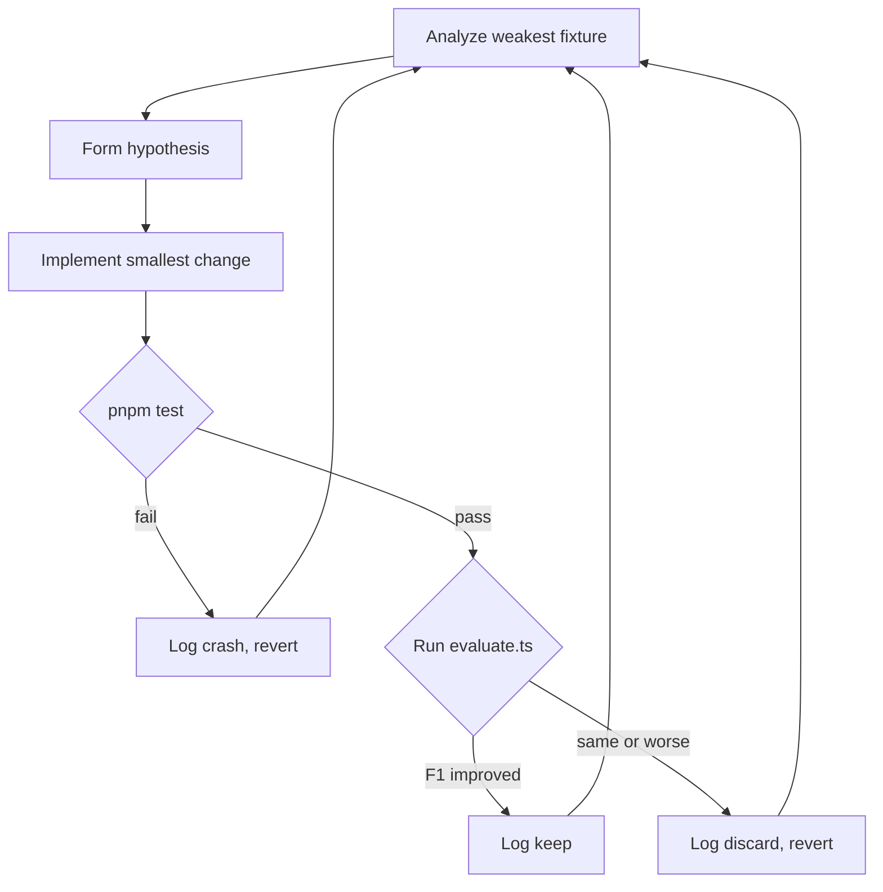
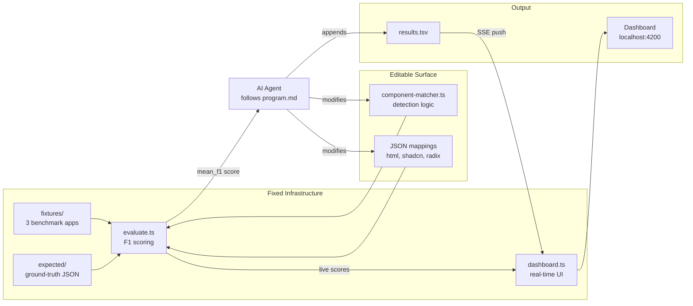
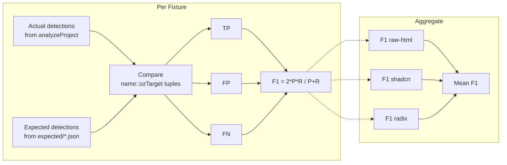

# Autoresearch: Component Detection Improvement Loop

An autonomous experiment loop — inspired by [Karpathy's autoresearch](https://github.com/karpathy/autoresearch) — that iteratively improves the `@openzeppelin/ui-cli` migration analyzer's ability to detect and map UI components from source libraries (raw HTML, shadcn/ui, Radix) to OpenZeppelin UI Kit equivalents.

## How it works

An AI agent follows a fixed protocol (`program.md`) to make small, atomic changes to the detection logic, evaluate each change against benchmark fixtures, and keep only the changes that improve the F1 score. A real-time dashboard visualizes progress.



## Quick start

### 1. Start the dashboard

```bash
pnpm --filter @openzeppelin/ui-cli dashboard
```

Open http://localhost:4200. The dashboard auto-refreshes as experiments run.

### 2. Verify the baseline

```bash
pnpm --filter @openzeppelin/ui-cli evaluate
```

Expected output: `mean_f1 ≈ 0.7556` (raw-html: 1.0, shadcn: 1.0, radix: 0.267).

### 3. Start the agent

Open a new Cursor agent chat and send:

> You are an autonomous research agent. Read and follow the protocol in `packages/cli/autoresearch/program.md` exactly. Your working directory is `packages/cli`. Begin the experiment loop now.

The agent will autonomously iterate until it reaches F1 = 1.0 or exhausts all reasonable approaches. Watch progress on the dashboard.

### 4. Review and commit

When the agent finishes, review the changes it made, run `pnpm test` to verify, and commit.

## Architecture



## File reference

| File | Role | Editable by agent? |
|---|---|---|
| `program.md` | Agent protocol — rules, editable surface, experiment format | No |
| `evaluate.ts` | Fixed evaluation harness — runs `analyzeProject` on all fixtures, computes F1 | No |
| `dashboard.ts` | HTTP server for the real-time dashboard | No |
| `dashboard.html` | Dashboard UI (Chart.js scatter plot, fixture bars, experiment log) | No |
| `fixtures/` | 3 benchmark React apps (raw-html, shadcn, radix) | No |
| `expected/` | Ground-truth component detection results per fixture | No |
| `results.tsv` | Experiment log (appended by agent, read by dashboard) | Created by agent |
| `analysis.ipynb` | Post-hoc Python notebook for visualization | No |
| `pyproject.toml` | Python dependencies for the notebook | No |

## Editable surface

The agent may **only** modify these 4 files:

1. `src/catalog/source-libraries/html-elements.json` — HTML element mappings
2. `src/catalog/source-libraries/shadcn.json` — shadcn/ui mappings
3. `src/catalog/source-libraries/radix.json` — Radix Primitives mappings
4. `src/analysis/component-matcher.ts` — Detection logic (import extraction, JSX counting, HTML scanning)

Every experiment must pass `pnpm test` or it is reverted. The agent cannot modify fixtures, expected results, or the evaluation harness — this prevents gaming the metric.

## Benchmark fixtures

| Fixture | Source library | Files | Expected components | Import style |
|---|---|---|---|---|
| `raw-html-app` | Native HTML elements | 7 | 9 (Button, Input, Checkbox, etc.) | N/A (tag detection) |
| `shadcn-app` | shadcn/ui | 8 | 14 (Button, Card, Dialog, etc.) | Named: `import { X } from '@/components/ui/...'` |
| `radix-app` | Radix Primitives | 8 | 13 (11 Radix + 2 HTML) | Namespace: `import * as X from '@radix-ui/react-...'` |

## Evaluation metric

**Mean F1** across all fixtures, computed on `(name, ozTarget)` tuples:

- **True positive**: expected component detected with correct OZ target
- **False positive**: detected component not in expected results
- **False negative**: expected component not detected

Per-fixture F1 is the harmonic mean of precision and recall. The aggregate is a simple mean of per-fixture F1 scores.



## Dashboard

The dashboard at http://localhost:4200 shows:

- **Stat cards** — Total experiments, best F1, current live F1, keep rate
- **Scatter chart** — All experiments plotted with a running-maximum line
- **Per-fixture breakdown** — Color-coded F1 bars with TP/FP/FN counts
- **Experiment log** — Full table with status badges and F1 deltas

It updates in real-time via Server-Sent Events when `results.tsv` changes.

Pass `--port <number>` to use a different port:

```bash
pnpm --filter @openzeppelin/ui-cli dashboard --port 3000
```

## Python notebook (optional)

For post-hoc analysis, a Jupyter notebook is included:

```bash
cd autoresearch
uv venv && uv pip install -e .
jupyter notebook analysis.ipynb
```

This produces a scatter plot with running-maximum lines, similar to Karpathy's original visualization.

## Results format

Each line in `results.tsv` is a tab-separated record:

```
<experiment_number>\t<status>\t<mean_f1>\t<description>
```

- `status`: `keep` (F1 improved), `discard` (no improvement, reverted), `crash` (tests failed, reverted)
- `mean_f1`: score after the experiment (6 decimal places)
