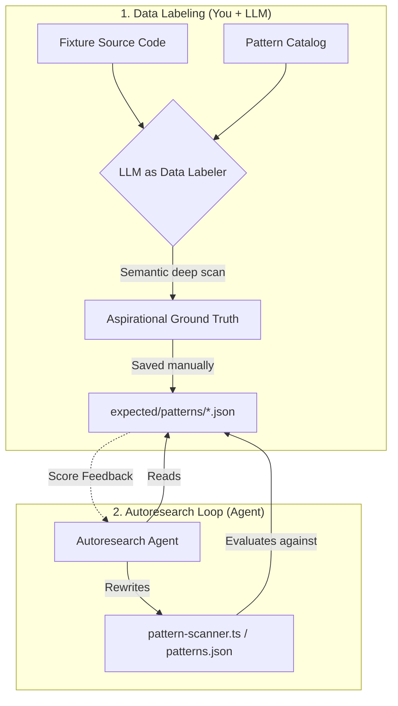

# Fixtures and expectations

This document explains **how to add a benchmark fixture** and, critically, **how to author the matching expectation files**. Dropping only source code under `fixtures/` without ground truth leaves the autoresearch harness blind: scores are meaningless, and regressions go unnoticed.

For the high-level autoresearch overview, see [README.md](./README.md).

---

## What “expectations” are for

Each capability compares **what the CLI does** on a fixture against **frozen ground truth** you commit under `expected/`.

- **Detection** — F1 on `(component name, ozTarget)` tuples vs `expected/<fixture>.json`.
- **Patterns** — F1 on `(pattern name, relative file path)` tuples vs `expected/patterns/<fixture>.json`.
- **Planning, init, execution, verification, orchestration** — each has its own files under `expected/<subdir>/` when that fixture participates in that capability.

Expectations are **the definition of correct** for those fixtures. They are not automatic truth: if you set expected output equal to whatever the scanner currently prints, the metric will read **1.0** but you will only have proven **agreement with today’s implementation**, not that the product is right for real migrations. Good practice is to encode **what migrators should care about** (and document edge cases), then change the implementation—or deliberately revise expectations—when they disagree.

---

## Adding a fixture: full checklist

### 1. Choose synthetic vs external


| Kind          | Where it lives                                                           | When to use                                                             |
| ------------- | ------------------------------------------------------------------------ | ----------------------------------------------------------------------- |
| **Synthetic** | `autoresearch/fixtures/<name>/` (committed)                              | Small, controlled scenarios (negative controls, one library at a time). |
| **External**  | Resolved into `fixtures/<name>/` via `_external.json` (often gitignored) | Real apps, monorepo slices, production-like trees.                      |


### 2. Register the fixture source

**External**

1. Add an entry to `[fixtures/_external.json](./fixtures/_external.json)` (repo, pinned commit, optional `subPath`, `sparsePaths`, etc.).
2. Add the fixture directory name to `[fixtures/.gitignore](./fixtures/.gitignore)` if the resolved tree must not be committed.
3. Run `npx tsx autoresearch/fetch-fixtures.ts` and verify with `--status`.

**Synthetic**

1. Create `autoresearch/fixtures/<name>/` with a minimal app (e.g. `src/`, `package.json` if needed).
2. Commit the tree.

### 3. Register metadata (per capability)

Evaluators that care about train/holdout/validation read small config files:

- `[config/detection-fixtures.json](./config/detection-fixtures.json)` — detection splits/tags.
- `[config/pattern-fixtures.json](./config/pattern-fixtures.json)` — patterns splits/tags.

Add a `{ "name": "<fixture>", "split": "train" | "holdout" | "validation", "tags": [...] }` entry when that fixture should participate in that capability’s scoring.

### 4. Add **all** expectation artifacts the fixture needs

A fixture is only picked up by an evaluator if the corresponding expected file **exists**. Use this map:


| Capability    | Expected path (typical)            | Notes                                                    |
| ------------- | ---------------------------------- | -------------------------------------------------------- |
| Detection     | `expected/<fixture>.json`          | Component ground truth; see existing fixtures for shape. |
| Patterns      | `expected/patterns/<fixture>.json` | Pattern × file list; see below.                          |
| Planning      | `expected/planning/...`            | See `program-planning.md` and existing frozen reports.   |
| Init          | `expected/init/...`                | Checklist expectations per `program-init.md`.            |
| Execution     | `expected/execution/...`           | Before/task/after triples per `program-execution.md`.    |
| Verification  | `expected/verification/...`        | Correct/broken projects per `program-verification.md`.   |
| Orchestration | `expected/orchestration/...`       | Per `program-orchestration.md`.                          |


**Rule of thumb:** if you add a fixture name to a capability config, you should add the matching `expected/` files for that capability, or evaluation will skip or fail for that combination.

### 5. Verify

```bash
pnpm --filter @openzeppelin/ui-cli evaluate:all
# or targeted:
npx tsx autoresearch/evaluate.ts --capability patterns
npx tsx autoresearch/evaluate.ts --capability detection
```

---

## Pattern expectations format

File: `expected/patterns/<fixture>.json`

```json
{
  "fixture": "my-app",
  "patterns": [
    {
      "name": "viem",
      "files": [
        "src/hooks/useClients.ts",
        "src/services/ExampleService.ts"
      ]
    },
    {
      "name": "localStorage",
      "files": ["src/App.tsx"]
    }
  ]
}
```

- `**name**` — Must match the **display name** the pattern catalog/scanner emits (e.g. `wagmi`, `viem`, `oz-ui-components`). If the catalog gains separate rules for subpaths (e.g. `wagmi/chains`), those names must match exactly.
- `**files`** — Paths **relative to the fixture root** (same as `scanPatterns` output). Sorting is optional; evaluation uses set equality.

---

## Using an LLM to draft expectations (safely)

Creating a rigorous ground truth file by hand across hundreds of files is exhausting. Using an LLM to generate it is highly recommended—**if you use the LLM correctly**.

### The Two-Agent Workflow: "Data Labeler" vs "Solver"

In an autoresearch loop, you split the problem into two distinct roles:



1. **The Data Labeler (Setup):** An LLM reads the codebase deeply using semantic understanding (not dumb regexes). It finds aliased imports, custom hooks wrapping `localStorage`, and edge cases, producing an **aspirational ground truth** file.
2. **The Solver (The Loop):** The autoresearch agent (using `program-patterns.md`) tries to rewrite the CLI's actual code (`pattern-scanner.ts`) to achieve a high score against that ground truth. It is **not allowed** to change the expectations to cheat.

**If you skip the Data Labeler and just copy the CLI's current output into the expectations file, the Solver agent will immediately score 1.0 and stop, learning nothing about its blind spots.**

### Example Prompt for Patterns Data Labeling

Open a new LLM chat (or Cursor context) with the fixture's codebase and run this prompt. This prompt is **specifically for the Patterns capability**. Other capabilities (like Detection or Planning) require different prompts because their JSON schemas differ.

```text
You are acting as an expert "Data Labeler" to build the absolute ground truth for a code migration benchmark.

Context:
- We are evaluating a CLI tool that scans codebases for specific patterns (wallet libraries, storage, etc.).
- The allowed pattern names are defined in the "displayName" fields inside `packages/cli/src/catalog/patterns.json`.
- We need to know EVERY file in the following fixture that truly uses these patterns, even if it's an edge case (aliased imports, wrapped in custom hooks, etc.).

Task:
1. Perform a deep semantic scan of all source files in the fixture directory (`fixtures/<FIXTURE_NAME>/`).
2. Identify every single file where the concepts from our pattern catalog are utilized.
3. Build a precise reverse index: for each valid pattern name, provide the sorted list of relative file paths (POSIX slashes) where that pattern occurs.

Critical Rules:
- Be aspirational and thorough: find the edge cases our dumb regex scanner might miss!
- Do NOT invent pattern names that are not in `patterns.json`. Use the exact "displayName" (e.g., if it imports "viem/chains" but the catalog only has "viem", use the exact name the catalog expects).
- Omit generated/vendor-only paths UNLESS they represent actual product usage we care about migrating.
- Output MUST be valid JSON matching the exact schema below. No markdown fences, no conversational text.

Output Schema:
{
  "fixture": "<FIXTURE_NAME>",
  "patterns": [
    { "name": "<pattern-display-name>", "files": ["relative/path.ts", "another/path.tsx"] }
  ]
}

Fixture name to scan: <FIXTURE_NAME>
```

Replace `<FIXTURE_NAME>` and provide the LLM with access to the fixture's files and `patterns.json`.

### Example Prompt for Detection Data Labeling

The Detection capability looks for specific UI components (like Buttons or Address fields). Because the mapping catalog is complex, we have a helper script to generate a first draft.

1. Run `npx tsx autoresearch/scaffold-expected.ts <FIXTURE_NAME>` to generate a scaffold file.
2. Give the LLM access to the fixture's codebase and the scaffold file.
3. Use this prompt to refine it:

```text
You are an expert "Data Labeler" building the absolute ground truth for our component detection benchmark.

Context:
- We have a scaffolded JSON file containing UI components our dumb regex scanner found in this codebase.
- The file maps components found in the code to their "ozTarget" (the OpenZeppelin UI component they should migrate to).

Task:
1. Review the provided scaffold JSON file against the fixture's actual source code.
2. Identify components the dumb scanner missed (e.g., heavily aliased imports, components wrapped in higher-order functions, or weird HTML usage).
3. Identify false positives the scanner hallucinates (e.g., a variable named "Button" that isn't actually a UI component).
4. Output the final, corrected JSON.

Rules:
- Be aspirational: find the edge cases!
- Do not change the JSON schema.
- Output MUST be valid JSON only. No markdown fences.
```

*Note: For other capabilities like Planning, Execution, or Verification, the expected artifacts are more complex. Read their respective `program-*.md` files to understand what ground truth they require before prompting an LLM.*

---

## Anti-patterns

- **Fixture without expectations** — Breaks or skips evaluation; defeats autoresearch.
- **Expectations = copy-paste of current scanner output** — Inflates F1 without validating behavior.
- **Mismatched pattern names** — Typos or wishful names (`wagmi/chains` when the scanner only reports `wagmi`) cause false misses until catalog or expectations align by design.
- **Wrong relative paths** — Paths must be relative to the fixture root as resolved on disk, not the monorepo root.

---

## Related tools

- **Detection scaffold:** `npx tsx autoresearch/scaffold-expected.ts <fixture-name>` generates a starting `expected/<fixture>.scaffold.json` from current detection output (still requires human review before renaming to `.json`). See comments in that script.

---

## See also


| Doc                                            | Purpose                                                    |
| ---------------------------------------------- | ---------------------------------------------------------- |
| [README.md](./README.md)                       | Autoresearch overview, `fetch-fixtures`, evaluate commands |
| [program-patterns.md](./program-patterns.md)   | Agent loop for improving pattern scanning                  |
| [program-detection.md](./program-detection.md) | Agent loop for component detection                         |
| Per-capability `program-*.md`                  | Editable surface and protocols for other capabilities      |


