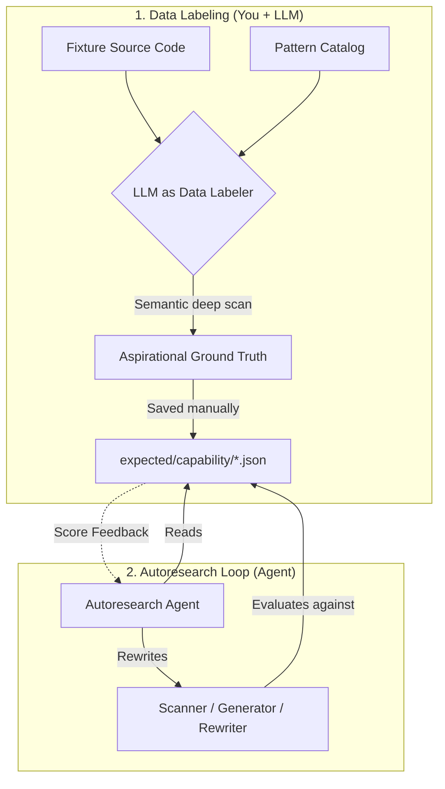

# LLM Prompts Collection for Data Labeling

Creating a rigorous ground truth file by hand across hundreds of files is exhausting. Using an LLM to generate it is highly recommended—**if you use the LLM correctly**.

This document contains **agent-ready** prompt templates for the different capabilities in the `@openzeppelin/ui-cli` autoresearch benchmark. Each prompt is designed to be dropped into a Cursor chat (or any agent with codebase access). The agent will find the files it needs on its own.

## The Two-Agent Workflow: "Data Labeler" vs "Solver"

In an autoresearch loop, you split the problem into two distinct roles:




1. **The Data Labeler (Setup):** An LLM reads the codebase deeply using semantic understanding (not dumb regexes). It finds aliased imports, custom hooks wrapping `localStorage`, and edge cases, producing an **aspirational ground truth** file.
2. **The Solver (The Loop):** The autoresearch agent tries to rewrite the CLI's actual code to achieve a high score against that ground truth. It is **not allowed** to change the expectations to cheat.

**If you skip the Data Labeler and just copy the CLI's current output into the expectations file, the Solver agent will immediately score 1.0 and stop, learning nothing about its blind spots.**

---

## How to use these prompts

1. Pick the capability section below.
2. Copy the prompt template into a Cursor chat (or any agent with codebase access).
3. Replace `<FIXTURE_NAME>` with the actual fixture name (e.g., `accounts-ui`).
4. The agent will read the referenced files itself — you don't need to paste anything.
5. Save the agent's JSON output to the path indicated in each section.

---

## 1. Detection Capability

**What it measures:** F1 on `(name, ozTarget)` tuples.

**Save output to:** `autoresearch/expected/<FIXTURE_NAME>.json`

**Example output** (from `shadcn-app.json`):

```json
{
  "fixture": "shadcn-app",
  "description": "Pure shadcn/ui app. Only top-level components with OZ catalog equivalents.",
  "components": [
    { "name": "Button", "ozTarget": "Button", "sourceLibrary": "shadcn" },
    { "name": "Dialog", "ozTarget": "Dialog", "sourceLibrary": "shadcn" },
    { "name": "Input", "ozTarget": "Input", "sourceLibrary": "shadcn" }
  ]
}
```

**Prompt:**

```text
You are a Data Labeler producing ground truth for a component detection benchmark.

1. From `packages/cli`, generate the scaffold (dumb scanner baseline; safe to re-run — it overwrites):
   `npx tsx autoresearch/scaffold-expected.ts <FIXTURE_NAME>`
   Output: `packages/cli/autoresearch/expected/<FIXTURE_NAME>.scaffold.json`

2. Read that scaffold — it has false positives and blind spots.

3. Read ALL source files under `packages/cli/autoresearch/fixtures/<FIXTURE_NAME>/`
and refine the scaffold:

- REMOVE false positives (variables named "Button" that aren't JSX components,
  icon components from lucide-react/heroicons, routing components like Route/Link).
- ADD components the scanner missed (aliased imports, barrel re-exports, HOC-wrapped components).
- FIX wrong "ozTarget" or "sourceLibrary" values. sourceLibrary must be the npm
  package name (e.g., "shadcn", "@radix-ui/react-dialog", "html-elements").

Every entry needs exactly three fields: "name", "ozTarget", "sourceLibrary".

Output a single valid JSON object to `packages/cli/autoresearch/expected/<FIXTURE_NAME>.json`:
{
  "fixture": "<FIXTURE_NAME>",
  "description": "<one sentence>",
  "components": [
    { "name": "...", "ozTarget": "...", "sourceLibrary": "..." }
  ]
}
```

---

## 2. Patterns Capability

**What it measures:** F1 on `(patternDisplayName, relativeFilePath)` tuples.

**Save output to:** `autoresearch/expected/patterns/<FIXTURE_NAME>.json`

**Example output** (from `accounts-ui.json`):

```json
{
  "fixture": "accounts-ui",
  "patterns": [
    { "name": "wagmi", "files": ["src/App.tsx", "src/hooks/useViemClients.ts"] },
    { "name": "localStorage", "files": ["src/App.tsx", "src/utils/storageKeys.ts"] }
  ]
}
```

**Prompt:**

```text
You are a Data Labeler producing ground truth for a pattern scanning benchmark.

Read the pattern catalog at `packages/cli/src/catalog/patterns.json` to learn
which patterns we track and their exact "displayName" values.

Then read ALL source files under `packages/cli/autoresearch/fixtures/<FIXTURE_NAME>/`
and find every file that uses any cataloged pattern. Be thorough — check for:
- Direct imports (`import { x } from 'wagmi'`)
- Subpath imports (`import { x } from 'viem/chains'` → pattern name is still "viem")
- Aliased re-exports through barrel files
- Content patterns like `localStorage.getItem(...)` inside custom hooks/wrappers

Use ONLY the exact "displayName" from the catalog. Do NOT invent pattern names.
File paths must be POSIX-style, relative to the fixture root, sorted alphabetically.
Omit patterns with zero matches.

Output a single valid JSON object to `packages/cli/autoresearch/expected/patterns/<FIXTURE_NAME>.json`:
{
  "fixture": "<FIXTURE_NAME>",
  "patterns": [
    { "name": "<displayName>", "files": ["path/to/file.ts"] }
  ]
}
```

---

## 3. Planning Capability

**What it measures:** Component Task F1 (60%) + Wallet Task F1 (20%) + Phase Order (20%), with a forbidden-task gate.

**Save output to:** `autoresearch/expected/planning/<FIXTURE_NAME>.json`

**Key detail:** The evaluator runs against a **frozen analysis report**, not the live fixture. Read the frozen report to understand the planner's input, and the fixture source to verify context. Do **not** rubber-stamp the current planner or existing expected file: the goal is aspirational ground truth for what a good planner should emit from that frozen input.

**Example output** (from `accounts-ui.json`):

```json
{
  "fixture": "accounts-ui",
  "analysisReport": "frozen-reports/accounts-ui.json",
  "expectedTasks": [
    { "type": "component-replacement", "sourceComponent": "Button", "targetComponent": "Button", "phase": "ui-components" }
  ],
  "forbiddenTasks": [
    { "sourceComponent": "Route", "reason": "react-router-dom, not a UI component" }
  ],
  "expectedWalletTasks": [
    { "pattern": "wagmi", "file": "src/App.tsx" }
  ],
  "forbiddenWalletFiles": [
    { "file": "src/services/sharing-codec.ts", "reason": "Only imports viem types, not wallet interaction" }
  ]
}
```

**Prompt:**

```text
You are a Data Labeler producing ground truth for a migration planning benchmark.

Read the frozen analysis report at
`packages/cli/autoresearch/expected/planning/frozen-reports/<FIXTURE_NAME>.json`
— this is the input the planner receives.

Then read the fixture source under `packages/cli/autoresearch/fixtures/<FIXTURE_NAME>/`
to verify context and produce four lists.

Important labeling rules:

1. Author **aspirational ground truth**, not "whatever the current planner emits".
   Do NOT copy from the existing expected file or infer labels from today's planner behavior.
2. The frozen report is the planner's input. Only include positive tasks that are justified by
   that frozen input. Do NOT add tasks based only on live-source context if the frozen report
   would never expose the signal.
3. Use the fixture source to validate meaning and to identify **false positives** the planner
   must avoid.
4. Be aggressive about negative labeling. A good expected file should catch both:
   - under-generation: missing tasks that should exist
   - over-generation: tasks for local app components, routing, icons, helpers, utilities, etc.
5. When classifying wallet-related files, distinguish:
   - real wallet/provider migration work
   - type-only imports
   - encoding/ABI utilities
   - chain registries / network metadata
   - pure validation/formatting helpers
   Only the first category belongs in `expectedWalletTasks`; the others belong in
   `forbiddenWalletFiles` when relevant.

Produce these four lists:

A) expectedTasks — every (type, sourceComponent, targetComponent, phase) the
   planner SHOULD emit. Do NOT include icon libraries, routing components,
   local app/page components, providers, or helper/controller components unless the
   frozen report clearly represents a real migration target.

B) forbiddenTasks — source components the planner must NOT create tasks for,
   with a reason (e.g., routing, icon, local feature component, provider, form helper,
   controller, or other non-migratable surface).

C) expectedWalletTasks — every (pattern, file) pair needing a wallet-replacement task.
   Include only files where the wallet library usage represents real adapter/provider/client
   migration work.

D) forbiddenWalletFiles — files with wallet imports that should NOT generate tasks
   (type-only imports, encoding utilities, chain registries, formatting/validation helpers,
   or similar false positives).

Before writing the final JSON, do this self-check:

1. If a bad planner generated tasks for Route/Link/providers/local wrappers/helpers, would this
   expected file penalize it?
2. If a bad planner skipped a real wallet/provider migration file, would this expected file
   penalize it?
3. Does every positive task come from the frozen report input rather than only from live-source
   intuition?
4. Did you avoid impossible expectations, such as pattern names or files that the frozen report
   never exposes?

Output a single valid JSON object to `packages/cli/autoresearch/expected/planning/<FIXTURE_NAME>.json`:
{
  "fixture": "<FIXTURE_NAME>",
  "analysisReport": "frozen-reports/<FIXTURE_NAME>.json",
  "expectedTasks": [{ "type": "...", "sourceComponent": "...", "targetComponent": "...", "phase": "..." }],
  "forbiddenTasks": [{ "sourceComponent": "...", "reason": "..." }],
  "expectedWalletTasks": [{ "pattern": "...", "file": "..." }],
  "forbiddenWalletFiles": [{ "file": "...", "reason": "..." }]
}
```

---

## 4. Init Capability

**What it measures:** Weighted checklist — does `oz-ui migrate init` create all expected files with the right content substrings?

**Save output to:** `autoresearch/expected/init/<FIXTURE_NAME>.json`

**Key detail:** Each fixture needs a project directory at `expected/init/<FIXTURE_NAME>/project/`. The JSON describes what must exist AFTER init runs on that project.

**Example output** (from `vite-project.json`):

```json
{
  "fixture": "vite-project",
  "projectDir": "vite-project/project",
  "expectedFiles": [
    { "path": "src/oz/OzProviders.tsx", "contentPatterns": ["RuntimeProvider", "WalletStateProvider", "@openzeppelin/ui-react"] },
    { "path": "tailwind.config.ts", "contentPatterns": ["@openzeppelin"] },
    { "path": ".cursor/skills/migrate-to-oz-uikit/SKILL.md", "contentPatterns": ["oz-ui", "migrate"] }
  ]
}
```

**Prompt:**

```text
You are a Data Labeler producing ground truth for a project initialization benchmark.

Read the fixture project at `packages/cli/autoresearch/expected/init/<FIXTURE_NAME>/project/`
to understand its starting state (package.json, tailwind config, app entry point).

Read the init templates at `packages/cli/src/templates/` to understand what
`oz-ui migrate init` generates.

Then produce a checklist of files that must exist after init runs, with
contentPatterns (plain substrings checked via String.includes()) that must
appear in each file.

Init typically creates: src/oz/OzProviders.tsx, src/oz/resolve-runtime.ts,
tailwind config updates, .cursor/skills/ and .cursor/agents/ files,
.claude/agents/ files.

Output a single valid JSON object to `packages/cli/autoresearch/expected/init/<FIXTURE_NAME>.json`:
{
  "fixture": "<FIXTURE_NAME>",
  "projectDir": "<FIXTURE_NAME>/project",
  "expectedFiles": [
    { "path": "relative/path.tsx", "contentPatterns": ["substring1", "substring2"] }
  ]
}
```

---

## 5. Execution Capability

**What it measures:** AST structural similarity between the rewriter's output and your `after.tsx`. Score > 0.9 = pass. Each test case is a `before.tsx` / `task.json` / `after.tsx` triple.

**Save output to:** `autoresearch/expected/execution/<tier>/<test-name>/` with three files each.

**Tiers:** `tier1/` (simple import swap), `tier2/` (namespace imports, prop renames), `tier3/` (real-world complex files).

**Example task.json:**

```json
{
  "id": "component-replacement-Button",
  "phase": "ui-components",
  "type": "component-replacement",
  "status": "pending",
  "description": "Replace Button with OZ Button",
  "file": "src/MyComponent.tsx",
  "sourceComponent": "Button",
  "targetComponent": "Button"
}
```

**Prompt:**

```text
You are a Data Labeler creating before/task/after test triples for a code
rewriting benchmark.

Read the fixture source under `packages/cli/autoresearch/fixtures/<FIXTURE_NAME>/`
and find 3-5 representative files that import UI components.

For each, create a directory under `packages/cli/autoresearch/expected/execution/`
with tier classification (tier1/tier2/tier3) containing:

- before.tsx — the original file content (verbatim from the fixture)
- task.json — a MigrationTask with fields: id, phase, type, status, description,
  file, sourceComponent, targetComponent (and optional propMappings if props rename)
- after.tsx — the perfect rewrite: old import replaced with
  @openzeppelin/ui-components, all JSX updated, valid TypeScript, formatting preserved

Cover edge cases: namespace imports (import * as X), compound components (Dialog.Content),
aliased imports, multi-component files.
```

---

## 6. Verification Capability

**What it measures:** `(classification × 0.6) + (diagnostic_keywords × 0.4)`. The evaluator runs `checkTask(task, projectDir)` and checks pass/fail + keyword presence.

**Save output to:** `autoresearch/expected/verification/<broken|correct>/<test-name>.json` + a project at `<broken|correct>/<test-name>/project/`

**Example output** (from `broken/orphaned-import.json`):

```json
{
  "fixture": "orphaned-import",
  "expectedStatus": "fail",
  "diagnosticKeywords": ["old import", "Button"],
  "task": {
    "id": "component-replacement-Button-src-App.tsx",
    "phase": "ui-components",
    "type": "component-replacement",
    "status": "pending",
    "description": "Replace Button with OZ Button in src/App.tsx",
    "file": "src/App.tsx",
    "sourceComponent": "Button",
    "targetComponent": "Button"
  },
  "projectDir": "broken/orphaned-import/project"
}
```

**Prompt:**

```text
You are a Data Labeler creating test fixtures for a migration verification
(doctor) benchmark.

Look at the existing verification fixtures under
`packages/cli/autoresearch/expected/verification/` to understand the pattern.

Then design 3-5 new scenarios — small project directories that represent
specific migration states:

Broken scenarios (expectedStatus: "fail"):
- orphaned old imports alongside new OZ imports
- missing OZ import after removing old component
- wrong package name in the replacement import

Correct scenarios (expectedStatus: "pass"):
- old import fully replaced with @openzeppelin/ui-components

For each, create the project files AND a JSON fixture with: fixture name,
expectedStatus, diagnosticKeywords (lowercase substrings the doctor should emit),
the MigrationTask being checked, and projectDir pointing to the project files.

diagnosticKeywords are checked with case-insensitive String.includes().
For "pass" scenarios, use an empty array.
```

---

## 7. Orchestration Capability

**What it measures:** (1) A hardcoded structural checklist against `SKILL.md` (you can't author this — it's in TypeScript), and (2) **scenario fixtures** describing command sequences.

You author scenario fixtures only.

**Save output to:** `autoresearch/expected/orchestration/<scenario-name>.json`

**Example output** (from `fresh-project-start.json`):

```json
{
  "name": "fresh-project-start",
  "description": "Starting migration from scratch on a new project. Agent should begin with init.",
  "expectedCommands": ["oz-ui migrate init", "oz-ui migrate analyze", "oz-ui migrate plan"],
  "expectedGates": ["init-complete-before-analyze", "analyze-complete-before-plan"]
}
```

**Prompt:**

```text
You are a Data Labeler creating scenario fixtures for an orchestration benchmark.

Read the SKILL.md protocol at
`packages/cli/src/templates/skills/migrate-to-oz-uikit/SKILL.md`
to understand the migration workflow it teaches to coding agents.

Look at existing scenarios under `packages/cli/autoresearch/expected/orchestration/`
to understand the format.

Then design 3-5 realistic scenarios an agent might encounter:
- Fresh project start (no prior migration)
- Resuming a partial migration (init/analyze done, needs plan + execute)
- Doctor fails mid-migration (must re-execute failing tasks)
- No components detected (should skip plan/execute)

For each scenario output a JSON with: name, description (one sentence),
expectedCommands (ordered CLI commands like "oz-ui migrate init"),
and expectedGates (sequencing invariants like "init-complete-before-analyze").
```

