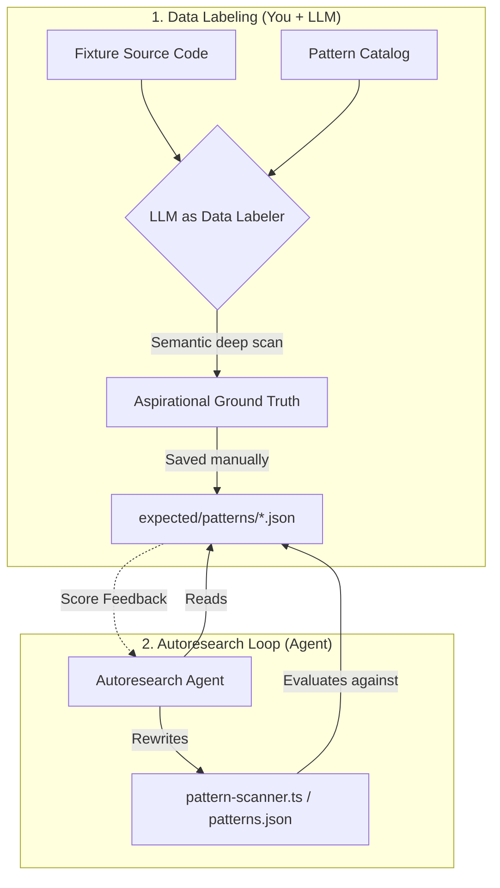

# LLM Prompts Collection for Data Labeling

Creating a rigorous ground truth file by hand across hundreds of files is exhausting. Using an LLM to generate it is highly recommended—**if you use the LLM correctly**.

This document contains a collection of prompt templates tailored for the different capabilities in the `@openzeppelin/ui-cli` autoresearch benchmark. 

## The Two-Agent Workflow: "Data Labeler" vs "Solver"

In an autoresearch loop, you split the problem into two distinct roles:



1. **The Data Labeler (Setup):** An LLM reads the codebase deeply using semantic understanding (not dumb regexes). It finds aliased imports, custom hooks wrapping `localStorage`, and edge cases, producing an **aspirational ground truth** file.
2. **The Solver (The Loop):** The autoresearch agent tries to rewrite the CLI's actual code to achieve a high score against that ground truth. It is **not allowed** to change the expectations to cheat.

**If you skip the Data Labeler and just copy the CLI's current output into the expectations file, the Solver agent will immediately score 1.0 and stop, learning nothing about its blind spots.**

---

## 1. Patterns Capability

Open a new LLM chat (or Cursor context) with the fixture's codebase and run this prompt.

```text
You are acting as an expert "Data Labeler" to build the absolute ground truth for a code migration benchmark.

Context:
- We are evaluating a CLI tool that scans codebases for specific patterns (wallet libraries, storage, etc.).
- The allowed pattern names are defined in the "displayName" fields inside `packages/cli/src/catalog/patterns.json`.
- We need to know EVERY file in the following fixture that truly uses these patterns, even if it's an edge case (aliased imports, wrapped in custom hooks, etc.).

Task:
1. Perform a deep semantic scan of all source files in the fixture directory (`fixtures/<FIXTURE_NAME>/`).
2. Identify every single file where the concepts from our pattern catalog are utilized.
3. Build a precise reverse index: for each valid pattern name, provide the sorted list of relative file paths (POSIX slashes) where that pattern occurs.

Critical Rules:
- Be aspirational and thorough: find the edge cases our dumb regex scanner might miss!
- Do NOT invent pattern names that are not in `patterns.json`. Use the exact "displayName" (e.g., if it imports "viem/chains" but the catalog only has "viem", use the exact name the catalog expects).
- Omit generated/vendor-only paths UNLESS they represent actual product usage we care about migrating.
- Output MUST be valid JSON matching the exact schema below. No markdown fences, no conversational text.

Output Schema:
{
  "fixture": "<FIXTURE_NAME>",
  "patterns": [
    { "name": "<pattern-display-name>", "files": ["relative/path.ts", "another/path.tsx"] }
  ]
}

Fixture name to scan: <FIXTURE_NAME>
```

*Instructions:* Replace `<FIXTURE_NAME>` and provide the LLM with access to the fixture's files and `packages/cli/src/catalog/patterns.json`.

---

## 2. Detection Capability

The Detection capability looks for specific UI components (like Buttons or Address fields). Because the mapping catalog is complex, we have a helper script to generate a first draft.

1. Run `npx tsx autoresearch/scaffold-expected.ts <FIXTURE_NAME>` to generate a scaffold file.
2. Give the LLM access to the fixture's codebase and the scaffold file.
3. Use this prompt to refine it:

```text
You are an expert "Data Labeler" building the absolute ground truth for our component detection benchmark.

Context:
- We have a scaffolded JSON file containing UI components our dumb regex scanner found in this codebase.
- The file maps components found in the code to their "ozTarget" (the OpenZeppelin UI component they should migrate to).

Task:
1. Review the provided scaffold JSON file against the fixture's actual source code.
2. Identify components the dumb scanner missed (e.g., heavily aliased imports, components wrapped in higher-order functions, or weird HTML usage).
3. Identify false positives the scanner hallucinates (e.g., a variable named "Button" that isn't actually a UI component).
4. Output the final, corrected JSON.

Rules:
- Be aspirational: find the edge cases!
- Do not change the JSON schema.
- Output MUST be valid JSON only. No markdown fences.
```

---

## Other Capabilities

For other capabilities like **Planning**, **Execution**, or **Verification**, the expected artifacts are more complex (e.g., Markdown frozen reports, or before/task/after code rewriting triples). 

Please read their respective `program-*.md` files to understand what ground truth they require before prompting an LLM.