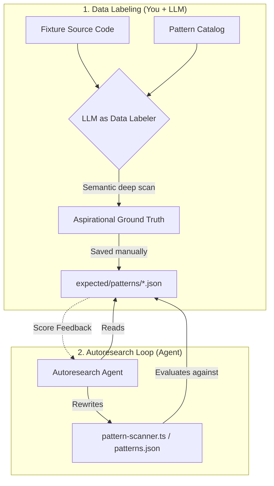

# LLM Prompts Collection for Data Labeling

Creating a rigorous ground truth file by hand across hundreds of files is exhausting. Using an LLM to generate it is highly recommended—**if you use the LLM correctly**.

This document contains a collection of prompt templates tailored for the different capabilities in the `@openzeppelin/ui-cli` autoresearch benchmark. 

## The Two-Agent Workflow: "Data Labeler" vs "Solver"

In an autoresearch loop, you split the problem into two distinct roles:



1. **The Data Labeler (Setup):** An LLM reads the codebase deeply using semantic understanding (not dumb regexes). It finds aliased imports, custom hooks wrapping `localStorage`, and edge cases, producing an **aspirational ground truth** file.
2. **The Solver (The Loop):** The autoresearch agent tries to rewrite the CLI's actual code to achieve a high score against that ground truth. It is **not allowed** to change the expectations to cheat.

**If you skip the Data Labeler and just copy the CLI's current output into the expectations file, the Solver agent will immediately score 1.0 and stop, learning nothing about its blind spots.**

---

## 1. Detection Capability

The Detection capability looks for specific UI components (like Buttons or Address fields). Because the mapping catalog is complex, we have a helper script to generate a first draft.

1. Run `npx tsx autoresearch/scaffold-expected.ts <FIXTURE_NAME>` to generate a scaffold file.
2. Give the LLM access to the fixture's codebase and the scaffold file.
3. Use this prompt to refine it:

```text
You are an expert "Data Labeler" building the absolute ground truth for our component detection benchmark.

Context:
- We have a scaffolded JSON file containing UI components our dumb regex scanner found in this codebase.
- The file maps components found in the code to their "ozTarget" (the OpenZeppelin UI component they should migrate to).

Task:
1. Review the provided scaffold JSON file against the fixture's actual source code.
2. Identify components the dumb scanner missed (e.g., heavily aliased imports, components wrapped in higher-order functions, or weird HTML usage).
3. Identify false positives the scanner hallucinates (e.g., a variable named "Button" that isn't actually a UI component).
4. Output the final, corrected JSON.

Rules:
- Be aspirational: find the edge cases!
- Do not change the JSON schema.
- Output MUST be valid JSON only. No markdown fences.
```

---

## 2. Patterns Capability

Open a new LLM chat (or Cursor context) with the fixture's codebase and run this prompt.

```text
You are acting as an expert "Data Labeler" to build the absolute ground truth for a code migration benchmark.

Context:
- We are evaluating a CLI tool that scans codebases for specific patterns (wallet libraries, storage, etc.).
- The allowed pattern names are defined in the "displayName" fields inside `packages/cli/src/catalog/patterns.json`.
- We need to know EVERY file in the following fixture that truly uses these patterns, even if it's an edge case (aliased imports, wrapped in custom hooks, etc.).

Task:
1. Perform a deep semantic scan of all source files in the fixture directory (`fixtures/<FIXTURE_NAME>/`).
2. Identify every single file where the concepts from our pattern catalog are utilized.
3. Build a precise reverse index: for each valid pattern name, provide the sorted list of relative file paths (POSIX slashes) where that pattern occurs.

Critical Rules:
- Be aspirational and thorough: find the edge cases our dumb regex scanner might miss!
- Do NOT invent pattern names that are not in `patterns.json`. Use the exact "displayName" (e.g., if it imports "viem/chains" but the catalog only has "viem", use the exact name the catalog expects).
- Omit generated/vendor-only paths UNLESS they represent actual product usage we care about migrating.
- Output MUST be valid JSON matching the exact schema below. No markdown fences, no conversational text.

Output Schema:
{
  "fixture": "<FIXTURE_NAME>",
  "patterns": [
    { "name": "<pattern-display-name>", "files": ["relative/path.ts", "another/path.tsx"] }
  ]
}

Fixture name to scan: <FIXTURE_NAME>
```

*Instructions:* Replace `<FIXTURE_NAME>` and provide the LLM with access to the fixture's files and `packages/cli/src/catalog/patterns.json`.

---

## 3. Planning Capability

The Planning capability evaluates whether the CLI generates the correct sequence of migration tasks (e.g., replacing components, migrating wallets) based on the codebase.

```text
You are an expert "Data Labeler" building the absolute ground truth for our migration planning benchmark.

Context:
- We are evaluating a CLI tool that generates a JSON migration plan containing tasks and phases.
- We need a "frozen report" (ground truth JSON) of all the migration tasks this codebase ACTUALLY requires.

Task:
1. Review the fixture's entire codebase.
2. Identify all components, wallet hooks, and storage APIs that need to be migrated to OpenZeppelin UI Kit.
3. Classify each task by `task_type`, `source_component`, and `target_component`.
4. Group these tasks into the correct migration phases (e.g., Setup, Components, Wallet, etc.) following proper dependency order.
5. Output a structured JSON plan matching the expected schema.

Rules:
- Include all workspace-local packages, but EXCLUDE components that are explicitly not part of the OZ migration surface (e.g., generic HTML elements unless configured to migrate, or icon libraries like lucide-react).
- Ensure the phase order makes logical sense (e.g., don't migrate a complex wallet component before basic UI primitives).
- Output MUST be valid JSON only. No markdown fences.
```

---

## 4. Init Capability

The Init capability evaluates whether `oz-ui migrate init` correctly bootstraps a project with the right configuration files and provider wrapping.

```text
You are an expert "Data Labeler" building the absolute ground truth for our project initialization benchmark.

Context:
- We are evaluating what files and content MUST exist after running `oz-ui migrate init` on a specific codebase.

Task:
1. Review the fixture's codebase (specifically package.json, tailwind config, and root layout/app files).
2. Determine exactly which files `init` needs to create or modify to bootstrap the OpenZeppelin UI Kit.
3. List the required file paths and the specific string patterns or AST structures that MUST be present in those files (e.g., `<RuntimeProvider>` wrapping the root, `@openzeppelin/ui-components` in dependencies).

Rules:
- Be highly specific about the content expectations (e.g., "must contain import { RuntimeProvider }").
- Tailor the expectations to the fixture's existing state (e.g., if Tailwind is already installed, expect a tailwind config modification; if not, expect a new tailwind config generation).
- Output the checklist as a valid JSON object mapping file paths to their required content patterns.
```

---

## 5. Execution Capability

The Execution capability evaluates the deterministic code rewriter by running it against specific code snippets (before/task/after triples).

```text
You are an expert "Data Labeler" building execution triples (before, task, after) for our code rewriting benchmark.

Context:
- We are testing an AST-based code rewriter that replaces old UI components with OpenZeppelin UI components.
- We need isolated test cases consisting of a `before.tsx` file, a `task.json` describing the migration, and an `after.tsx` file showing the perfect result.

Task:
1. Review the fixture's source code and extract 3-5 representative files that need component replacement.
2. For each file, capture the original code (`before.tsx`).
3. Define the specific migration task (`task.json`) targeting that file.
4. Manually rewrite the code exactly as a perfect AST transformation would (`after.tsx`), ensuring imports are updated, props are mapped correctly, and formatting is preserved where possible.

Rules:
- Cover edge cases: namespace imports (`import * as Dialog`), compound components (`Dialog.Content`), and aliased imports.
- Ensure `after.tsx` is completely valid TypeScript/React code.
- Provide the output clearly separated by file names.
```

---

## 6. Verification Capability

The Verification capability (the `doctor` command) evaluates whether the CLI correctly flags incomplete, broken, or misconfigured migrations.

```text
You are an expert "Data Labeler" building the absolute ground truth for our verification (doctor) benchmark.

Context:
- We are testing the `oz-ui migrate doctor` command, which scans a project and outputs diagnostics (errors/warnings) if the migration is broken.

Task:
1. Review the provided "broken" fixture codebase.
2. Identify every single migration error present (e.g., orphaned old imports alongside new OZ imports, missing RuntimeProvider, wrong package names).
3. Draft the exact diagnostic warnings and errors the doctor should emit.
4. Provide a boolean classification: should this project pass or fail verification?

Rules:
- Diagnostics must be precise (e.g., mention the exact file and component).
- Do not penalize unrelated code issues; focus ONLY on migration invariants.
- Output a JSON object containing the expected `pass` boolean and a list of expected `diagnostics` (substrings we expect to find in the CLI output).
```

---

## 7. Orchestration Capability

The Orchestration capability evaluates the `SKILL.md` protocol to ensure it guides agents correctly through the entire migration workflow.

```text
You are an expert "Data Labeler" building the checklist expectations for our Orchestration benchmark.

Context:
- We are evaluating a `SKILL.md` file that teaches coding agents how to use the `oz-ui` CLI.
- The evaluation checks if the skill document contains all necessary instructions, phase gates, and error recovery steps.

Task:
1. Read the provided `SKILL.md` protocol.
2. Compare it against the ideal migration workflow: Init -> Analyze -> Plan -> Execute -> Doctor.
3. Identify if any critical instructions are missing (e.g., "what to do if Doctor fails", "how to resume a partial migration", "requiring human approval before execution").
4. Output a strict JSON checklist of boolean assertions that the evaluator should verify against the text.

Rules:
- Focus on executable guidance, not prose aesthetics.
- Ensure the checklist enforces strict phase gating (an agent must not skip planning).
- Output valid JSON only.
```