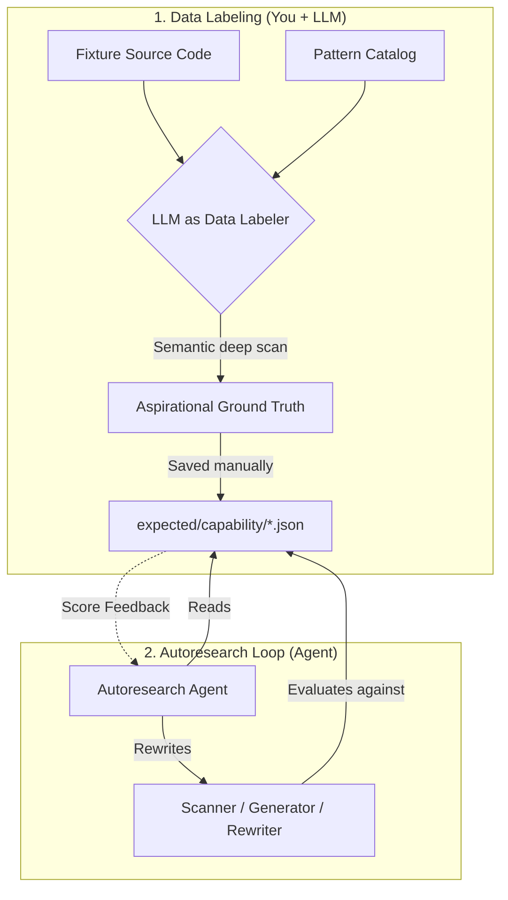

# LLM Prompts Collection for Data Labeling

Creating a rigorous ground truth file by hand across hundreds of files is exhausting. Using an LLM to generate it is highly recommended—**if you use the LLM correctly**.

This document contains a collection of prompt templates tailored for the different capabilities in the `@openzeppelin/ui-cli` autoresearch benchmark. 

## The Two-Agent Workflow: "Data Labeler" vs "Solver"

In an autoresearch loop, you split the problem into two distinct roles:



1. **The Data Labeler (Setup):** An LLM reads the codebase deeply using semantic understanding (not dumb regexes). It finds aliased imports, custom hooks wrapping `localStorage`, and edge cases, producing an **aspirational ground truth** file.
2. **The Solver (The Loop):** The autoresearch agent tries to rewrite the CLI's actual code to achieve a high score against that ground truth. It is **not allowed** to change the expectations to cheat.

**If you skip the Data Labeler and just copy the CLI's current output into the expectations file, the Solver agent will immediately score 1.0 and stop, learning nothing about its blind spots.**

---

## 1. Detection Capability

**Evaluator:** Measures F1 on `(name, ozTarget)` tuples — how accurately does the analyzer identify UI components and map them to OZ equivalents?

**Schema:** `expected/detection/<fixture>.json`

```json
{
  "fixture": "<FIXTURE_NAME>",
  "description": "optional human-readable description",
  "components": [
    { "name": "Button", "ozTarget": "Button", "sourceLibrary": "shadcn/ui" }
  ]
}
```

**The tuple that is scored is `name::ozTarget`.** Every entry also needs `sourceLibrary` (used for per-library breakdown metrics). The evaluator ignores components where `ozTarget` is null.

**Steps:**

1. Run `npx tsx autoresearch/scaffold-expected.ts <FIXTURE_NAME>` to generate a scaffold file.
2. Give the LLM access to the fixture's codebase and the scaffold file.
3. Use this prompt to refine it:

```text
You are an expert "Data Labeler" building the absolute ground truth for our component detection benchmark.

Context:
- We have a scaffolded JSON file containing UI components our dumb regex scanner found in this codebase.
- Each entry maps a source component (its import name) to:
  - "ozTarget": the exact OpenZeppelin UI component it should migrate to
  - "sourceLibrary": the npm package it currently comes from (e.g. "shadcn/ui", "@radix-ui/react-dialog")

Task:
1. Review the provided scaffold JSON against the fixture's actual source code.
2. Identify components the dumb scanner MISSED (e.g., heavily aliased imports, components wrapped
   in higher-order functions, components re-exported through local barrel files).
3. Identify false positives the scanner hallucinated (e.g., a variable named "Button" that is a
   string constant, not a rendered JSX component).
4. Ensure every entry has the correct "sourceLibrary" (exact npm package name, not a file path).
5. Output the final, corrected JSON.

Rules:
- Be aspirational: find the edge cases the regex scanner will miss!
- Do NOT change the JSON schema. All three fields (name, ozTarget, sourceLibrary) are required per entry.
- "ozTarget" must be a valid OZ component name from the migration catalog.
- Output MUST be valid JSON only. No markdown fences.

Output Schema:
{
  "fixture": "<FIXTURE_NAME>",
  "components": [
    { "name": "<ComponentName>", "ozTarget": "<OZComponentName>", "sourceLibrary": "<npm-package>" }
  ]
}
```

---

## 2. Patterns Capability

**Evaluator:** Measures F1 on `(patternName, relativeFilePath)` tuples — does the scanner identify every file using wallet libraries, storage APIs, and existing OZ packages?

**Schema:** `expected/patterns/<fixture>.json`

```json
{
  "fixture": "<FIXTURE_NAME>",
  "patterns": [
    { "name": "wagmi", "files": ["src/App.tsx", "src/hooks/useViemClients.ts"] },
    { "name": "localStorage", "files": ["src/storage/DraftStorage.ts"] }
  ]
}
```

Open a new LLM chat (or Cursor context) with the fixture's codebase and run this prompt:

```text
You are acting as an expert "Data Labeler" to build the absolute ground truth for a code migration benchmark.

Context:
- We are evaluating a CLI tool that scans codebases for specific patterns (wallet libraries, storage, etc.).
- The allowed pattern names are defined in the "displayName" fields inside `packages/cli/src/catalog/patterns.json`.
- We need to know EVERY file in the following fixture that truly uses these patterns, even if it's an
  edge case (aliased imports, wrapped in custom hooks, re-exported through local barrels, etc.).

Task:
1. Perform a deep semantic scan of all source files in the fixture directory (`fixtures/<FIXTURE_NAME>/`).
2. Identify every single file where the concepts from our pattern catalog are utilized.
3. Build a precise reverse index: for each valid pattern name, provide the sorted list of relative
   file paths (POSIX slashes, relative to the fixture root) where that pattern occurs.

Critical Rules:
- Be aspirational and thorough: find the edge cases our dumb regex scanner might miss!
- Do NOT invent pattern names. Use the exact "displayName" values from `patterns.json`
  (e.g., if a file imports "viem/chains" but the catalog only has "viem", use "viem").
- Omit generated/vendor-only paths UNLESS they represent actual product code we care about migrating.
- Output MUST be valid JSON matching the exact schema below. No markdown fences, no conversational text.

Output Schema:
{
  "fixture": "<FIXTURE_NAME>",
  "patterns": [
    { "name": "<pattern-display-name>", "files": ["relative/path.ts", "another/path.tsx"] }
  ]
}

Fixture name to scan: <FIXTURE_NAME>
```

*Replace `<FIXTURE_NAME>` and provide the LLM with access to the fixture's files and `packages/cli/src/catalog/patterns.json`.*

---

## 3. Planning Capability

**Evaluator:** Gated composite score — Component Task F1 (60%) + Wallet Task F1 (20%) + Phase Order accuracy (30%). If `forbiddenTasks` appear in actual output at a ratio > 10%, the score is capped at 0.5.

**Key architecture note:** The planning evaluator runs against a **frozen analysis report** (a pre-captured snapshot of the `analyzeProject()` output), not the live fixture code. This isolates planning quality from detection quality. The `analysisReport` field must point to an existing file in `expected/planning/frozen-reports/`.

**Schema:** `expected/planning/<fixture>.json`

```json
{
  "fixture": "<FIXTURE_NAME>",
  "analysisReport": "frozen-reports/<fixture>.json",
  "expectedTasks": [
    { "type": "component-replacement", "sourceComponent": "Button", "targetComponent": "Button", "phase": "ui-components" }
  ],
  "forbiddenTasks": [
    { "sourceComponent": "Route", "reason": "react-router-dom routing, not a UI component" }
  ],
  "expectedWalletTasks": [
    { "pattern": "wagmi", "file": "src/App.tsx" },
    { "pattern": "viem", "file": "src/hooks/useViemClients.ts" }
  ],
  "forbiddenWalletFiles": [
    { "file": "src/services/sharing-codec.ts", "reason": "Only imports viem types, not wallet interaction" }
  ]
}
```

```text
You are an expert "Data Labeler" building the absolute ground truth for our migration planning benchmark.

Context:
- We are evaluating a CLI tool that generates migration tasks from a codebase analysis report.
- The planning evaluator scores three things:
  1. Component task F1: were the right (type, sourceComponent, targetComponent) tuples emitted?
  2. Wallet task F1: were the right (pattern, file) wallet replacement tasks emitted?
  3. Phase order: did each task land in the correct migration phase?
- There is also a "forbidden" guard: any component that should NOT generate a migration task
  (e.g., framework primitives, routing components, icon libraries) must be listed as forbidden.

Task:
1. Review the fixture's codebase and the frozen analysis report at `frozen-reports/<FIXTURE_NAME>.json`.
2. For component tasks: list every (sourceComponent, targetComponent) pair that should be migrated,
   and which phase each belongs to (e.g., "ui-components").
3. For wallet tasks: list every (pattern, file) pair where a wallet library needs replacement.
4. For forbidden tasks: list any source components the planner must NOT generate tasks for,
   with a reason (e.g., routing components, icon libraries, native HTML elements).
5. For forbidden wallet files: list any files where the wallet import is structural/type-only and
   should NOT generate a wallet replacement task.

Rules:
- Phases available: "setup", "ui-components", "wallet-integration", "cleanup" (check the CLI source
  for the canonical list before authoring).
- Do NOT include icon libraries (lucide-react, heroicons, etc.) as migration targets.
- Do NOT include routing components (Route, Link from react-router-dom) as migration targets.
- Output MUST be valid JSON only. No markdown fences.

Output Schema:
{
  "fixture": "<FIXTURE_NAME>",
  "analysisReport": "frozen-reports/<FIXTURE_NAME>.json",
  "expectedTasks": [
    { "type": "component-replacement", "sourceComponent": "...", "targetComponent": "...", "phase": "..." }
  ],
  "forbiddenTasks": [{ "sourceComponent": "...", "reason": "..." }],
  "expectedWalletTasks": [{ "pattern": "...", "file": "..." }],
  "forbiddenWalletFiles": [{ "file": "...", "reason": "..." }]
}
```

---

## 4. Init Capability

**Evaluator:** Weighted checklist score — copies the fixture project to a temp dir, runs `oz-ui migrate init --skip-install`, then checks that all `expectedFiles` exist with all their `contentPatterns` present.

**Key architecture note:** Each init fixture needs an actual project directory on disk at `expected/init/<fixture>/project/` (or a `projectDir` override). The expected JSON only describes what MUST exist after init runs, not the starting state.

**Schema:** `expected/init/<fixture>.json`

```json
{
  "fixture": "<FIXTURE_NAME>",
  "projectDir": "<FIXTURE_NAME>/project",
  "expectedFiles": [
    {
      "path": "src/oz/OzProviders.tsx",
      "contentPatterns": ["RuntimeProvider", "WalletStateProvider", "@openzeppelin/ui-react"]
    },
    {
      "path": "tailwind.config.ts",
      "contentPatterns": ["@openzeppelin"]
    },
    {
      "path": ".cursor/skills/migrate-to-oz-uikit/SKILL.md",
      "contentPatterns": ["oz-ui", "migrate"]
    }
  ]
}
```

```text
You are an expert "Data Labeler" building the ground truth checklist for our project initialization benchmark.

Context:
- We are evaluating what files and content MUST exist after running `oz-ui migrate init` on a project.
- The evaluator copies the project, runs init, then checks for each expected file + content patterns.
- Init typically creates: src/oz/OzProviders.tsx, src/oz/resolve-runtime.ts, tailwind config updates,
  and agent/skill files for Cursor (.cursor/skills/, .cursor/agents/) and Claude (.claude/agents/).

Task:
1. Review the fixture project at `<FIXTURE_NAME>/project/`.
2. Determine which files init MUST create or modify for this specific project setup.
3. For each required file, specify the exact string substrings (contentPatterns) that MUST be present
   in that file after init. Be specific — include import paths, component names, and key identifiers.

Rules:
- contentPatterns are plain string substrings (not regex), checked with `String.includes()`.
- Only assert patterns that init deterministically produces — do not assert things that vary by input.
- If Tailwind is already present, expect it to be patched with the OZ preset. If absent, expect a
  new tailwind.config.ts to be created.
- Output MUST be valid JSON only. No markdown fences.

Output Schema:
{
  "fixture": "<FIXTURE_NAME>",
  "projectDir": "<FIXTURE_NAME>/project",
  "expectedFiles": [
    { "path": "relative/file/path.tsx", "contentPatterns": ["string1", "string2"] }
  ]
}
```

---

## 5. Execution Capability

**Evaluator:** AST structural similarity between the rewriter's actual output and the `after.tsx` ground truth. Score > 0.9 → pass. Each test case lives in its own directory as a `before.tsx` / `task.json` / `after.tsx` triple.

**Directory structure:** `expected/execution/<tier>/<test-name>/`
- `tier1/` — simple single-component import swaps
- `tier2/` — intermediate (namespace imports, prop renames, multi-component)
- `tier3/` — real-world complex transformations

**`task.json` schema:**

```json
{
  "id": "component-replacement-Button",
  "phase": "ui-components",
  "type": "component-replacement",
  "status": "pending",
  "description": "Replace Button with OZ Button",
  "file": "src/MyComponent.tsx",
  "sourceComponent": "Button",
  "targetComponent": "Button",
  "propMappings": { "variant": "variant" }
}
```

```text
You are an expert "Data Labeler" creating before/task/after execution triples for our code rewriting benchmark.

Context:
- We test an AST-based code rewriter that replaces old UI components with OpenZeppelin UI components.
- Each test case is a directory containing: before.tsx (input), task.json (migration spec), after.tsx (perfect output).
- The evaluator scores AST structural similarity between actual rewriter output and after.tsx.
  A score above 0.9 is a pass. The comparison normalizes whitespace but is line-level, so after.tsx
  must be written exactly as the rewriter should produce it.

Task:
1. Review the fixture's source code and extract representative files needing component replacement.
2. Classify each case by complexity tier:
   - tier1: single named import, trivial swap (Button → OZ Button)
   - tier2: namespace imports (import * as Dialog), compound components (Dialog.Content), prop renames
   - tier3: real-world files with multiple components, dynamic props, conditional rendering
3. For each case, produce:
   - before.tsx: the original file content (verbatim copy from the fixture)
   - task.json: the MigrationTask describing what to rewrite
   - after.tsx: the perfect output as the AST rewriter should produce it (updated imports, mapped props)

task.json schema:
{
  "id": "component-replacement-<ComponentName>",
  "phase": "ui-components",
  "type": "component-replacement",
  "status": "pending",
  "description": "Replace <Source> with OZ <Target> in <file>",
  "file": "<relative-file-path>",
  "sourceComponent": "<SourceComponentName>",
  "targetComponent": "<TargetComponentName>",
  "propMappings": { "<oldProp>": "<newProp>" }
}

Rules:
- after.tsx must be valid TypeScript/React with correct bracket balance.
- Preserve whitespace and formatting style from before.tsx as much as possible.
- Cover edge cases: namespace imports (`import * as X`), re-exports, aliased imports.
- propMappings is optional — only include it if prop names change.
- Output each file's content labeled clearly by filename.
```

---

## 6. Verification Capability

**Evaluator:** `(classification_accuracy × 0.6) + (diagnostic_precision × 0.4)`. The evaluator runs `checkTask(task, projectDir)` on a real project directory and checks: (1) does `result.passed` match `expectedStatus`? (2) do the actual diagnostic strings contain the expected `diagnosticKeywords`?

**Key architecture note:** Each verification fixture needs an actual project directory on disk at `expected/verification/<broken|correct>/<fixture-name>/project/`. The JSON describes the task being checked AND what the checker should conclude.

**Schema:** `expected/verification/<broken|correct>/<fixture-name>.json`

```json
{
  "fixture": "orphaned-import",
  "expectedStatus": "fail",
  "diagnosticKeywords": ["old import", "Button"],
  "task": {
    "id": "component-replacement-Button-src-App.tsx",
    "phase": "ui-components",
    "type": "component-replacement",
    "status": "pending",
    "description": "Replace Button with OZ Button in src/App.tsx",
    "file": "src/App.tsx",
    "sourceComponent": "Button",
    "targetComponent": "Button"
  },
  "projectDir": "broken/orphaned-import/project"
}
```

```text
You are an expert "Data Labeler" building the ground truth for our verification (doctor) benchmark.

Context:
- We test the `oz-ui migrate doctor` command, which checks if a specific migration task was completed
  correctly in a project directory.
- The evaluator runs `checkTask(task, projectDir)` and scores:
  - Classification: did the doctor correctly pass or fail this project? (60% weight)
  - Diagnostics: does the doctor's output contain the expected keyword substrings? (40% weight)
- You need to describe both: the task being verified, AND what the doctor should conclude.

Task:
1. Review the provided "broken" or "correctly migrated" fixture project.
2. Determine if the migration task was completed correctly (expectedStatus: "pass" or "fail").
3. If it should fail, identify the exact diagnostic keywords the doctor MUST emit (lowercase substrings
   expected to appear somewhere in the diagnostic output — e.g., file paths, component names, error types).
4. Define the MigrationTask the doctor is checking (which file, which component was supposed to be migrated).

Rules:
- diagnosticKeywords are case-insensitive substrings — keep them short and specific (e.g., "old import", "Button").
- "pass" fixtures should have an empty diagnosticKeywords array.
- Focus ONLY on migration invariants (old imports still present, missing providers, wrong package names).
  Do NOT flag unrelated code issues.
- projectDir must point to the fixture's actual project directory relative to `expected/verification/`.
- Output MUST be valid JSON only. No markdown fences.

Output Schema:
{
  "fixture": "<fixture-name>",
  "expectedStatus": "pass" | "fail",
  "diagnosticKeywords": ["keyword1", "keyword2"],
  "task": {
    "id": "component-replacement-<Component>-<file-slug>",
    "phase": "ui-components",
    "type": "component-replacement",
    "status": "pending",
    "description": "Replace <Source> with OZ <Target> in <file>",
    "file": "<relative-file-path>",
    "sourceComponent": "<SourceComponentName>",
    "targetComponent": "<TargetComponentName>"
  },
  "projectDir": "<broken|correct>/<fixture-name>/project"
}
```

---

## 7. Orchestration Capability

**Evaluator:** Two modes — (1) a **hardcoded structural checklist** that runs against the actual `SKILL.md` file (this is fixed TypeScript code and cannot be authored by a labeler); (2) **scenario fixtures** that describe the command sequence an agent should follow in a given situation.

The scenario fixtures in `expected/orchestration/` are currently used as a future LLM replay surface. Authoring them now documents the expected agent behavior and will feed into automated evaluation once the LLM replay integration is complete.

**Schema:** `expected/orchestration/<scenario-name>.json`

```json
{
  "name": "fresh-project-start",
  "description": "Starting migration from scratch on a new project. Agent should begin with init.",
  "expectedCommands": ["oz-ui migrate init", "oz-ui migrate analyze", "oz-ui migrate plan"],
  "expectedGates": ["init-complete-before-analyze", "analyze-complete-before-plan"]
}
```

```text
You are an expert "Data Labeler" authoring scenario fixtures for our orchestration benchmark.

Context:
- We evaluate whether the `SKILL.md` protocol correctly guides a coding agent through the OZ UI
  migration workflow.
- Each scenario fixture describes a realistic situation an agent might face and the EXACT sequence
  of CLI commands the agent MUST run, in order, along with the phase gates that must be respected.
- The evaluator will eventually replay each scenario with an LLM and check if the agent's command
  sequence matches expectedCommands and expectedGates.

Task:
1. Read the provided `SKILL.md` protocol.
2. Identify 3-5 realistic scenarios an agent might encounter:
   - Fresh project start (no prior migration)
   - Resuming a partial migration
   - Doctor fails mid-migration
   - Analyzing a project with no detected components
   - Recovering from a failed execution step
3. For each scenario, produce a fixture JSON describing:
   - The situation ("description")
   - The exact ordered CLI commands the agent must run ("expectedCommands")
   - The phase gates that must be respected ("expectedGates" — strings like "X-before-Y")

Rules:
- expectedCommands must use the full CLI command format (e.g., "oz-ui migrate init").
- expectedGates encode sequencing invariants as readable strings — keep them short.
- Each scenario must be a single, self-contained JSON object.
- Output each scenario as a separate JSON block clearly labeled by filename.
```
